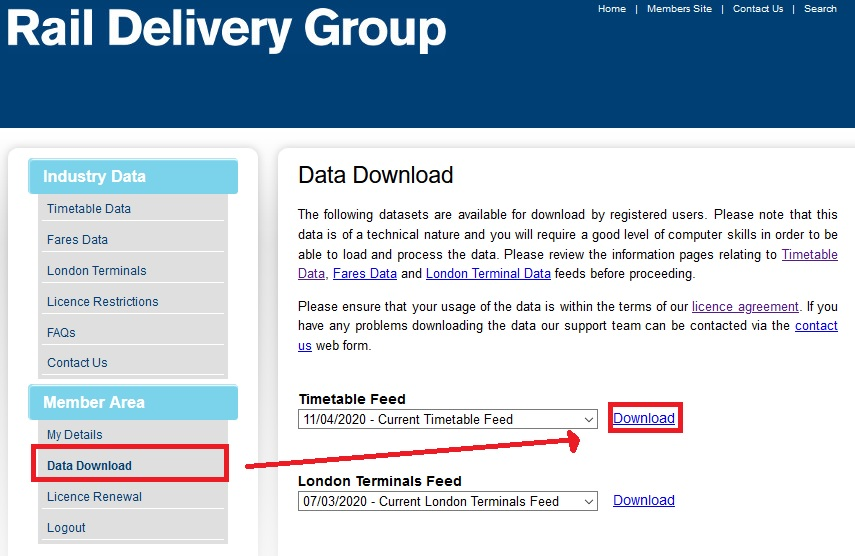

This vignette outlines how to produce GTFS timetables for the heavy rail network using ATOC CIF files.

## Getting Data

Data for train timetables can be downloaded from http://data.atoc.org/how-to you will need to register for a free account and log in.

```{r, echo=FALSE, fig.align='center', fig.cap="\\label{fig:atoc_download}Download ATOC data"}

```

You will get a zipped folder with a name like `ttis123.zip`.

## Converting ATOC Data to GTFS

To do a simple conversion to GTFS, load the package, and use the `atoc2gtfs` function. The function requires the following arguments.

* `path_in` is the file path to the ATOC timetable file, this comes a zipped folder with a name like `ttis123.zip`
* `path_out` is the path to a folder where the results will be saved
* `name` is the file name of the result by default `gtfs.zip`
* `ncores` If > 1 then multicore processing is used to speed up the processing. Always leave one spare core for your OS.

A simple example is shown below:

```{r atoc_example, eval=FALSE}
library(UK2GTFS)
path_in <- "C:/Users/malco/OneDrive - University of Leeds/Data/UK2GTFS/ATOC/timetable/2020-05-02"
path_in <-  file.path(path_in,"ttis627.zip")
path_out = "C:/Users/malco/OneDrive - University of Leeds/Data/UK2GTFS/GTFS/gtfs_20200502"
atoc2gtfs(path_in = path_in, 
          path_out = path_out,
          name = "gtfs_ttis627",
          ncores = 3)

```

This will save the GTFS file to `E:/GTFS/ttis381_gtfs.zip`

## Advanced features

The `atoc2gtfs()` function gives some customization options to how the GTFS file is built. It is also just a wrapper around other functions in the package. This section will explain the main steps.

### Importing ATOC Data

After unzipping the folder, the reading of the ATOC data is done with the following functions:


* `importMCA()` the main file with the timetable data, 
* `importFLF()` optional file used if `transfers = TRUE`
* `importMSN()` optional file used if `locations = "file"`

Other files are currently ignored.

### TIPLOC Locations

The timetable data refers to locations such as stations, junctions, etc using a TIPLOC id. The locations of these are stored in the `.msn` file, but are not always accurate. Therefore the package comes with a `tiplocs` object which includes improved location data for TIPLOCS.

IF you wanted to build using the locations included in the ATOC data, then you can use `locations = "file"` in `atoc2gtfs()` or manually build the stops using `station2stops()`.


### Agency 

The data required to create the GTFS `agency.txt` file is not present in the ATOC CIF files. Therefore the package contains an example file instead.


